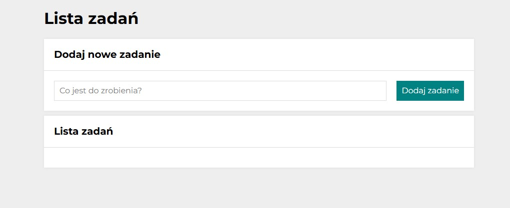
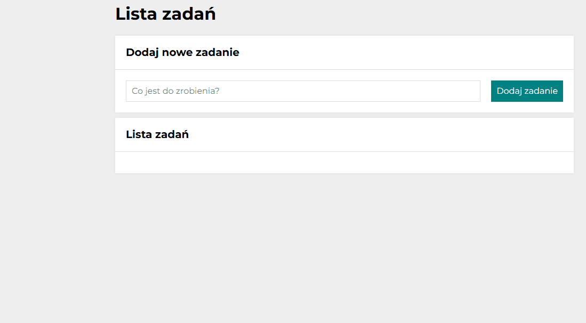

# To-Do List 

## Demo 
https://annaczerwonka.github.io/todo-list-react/

## General Info
The todo-list application consists of two main elements:
1. A form with a field for entering tasks and a "Add Task" button.
2. A task list with the following options:
   - marking a task as completed, which crosses out its text (green button)
   - removing a task from the list (red button)
   - two additional buttons:
      - the first button hides or shows completed tasks
      - the second button marks all tasks as completed
      - these buttons follow these rules:
          - if the task list is empty, the buttons are not displayed
          - if all tasks are completed, the second button becomes disabled
          - note: since the app starts with an empty list, initially the buttons are hidden

**Additional features:**
- The application now starts with an empty task list.
- Tasks added via the form are saved in `localStorage`, so they persist after refreshing the page.
- Input automatically focuses after adding a task.
- Task logic moved to custom hook `useTasks`.
- Styles migrated to `styled-components` with `ThemeProvider`.

##   

## Technologies

- HTML
- CSS (Flexbox, Grid)
- JavaScript (ES6+)
- JSX (JavaScript XML)
- React.js 
- React Hooks (`useState`, `useEffect`, `useTasks`)
- Local Storage API
- Create React App (Webpack, Babel, ESLint, PostCSS, CSS Loader, Style Loader)
- styled-components

# Getting Started with Create React App

This project was bootstrapped with [Create React App](https://github.com/facebook/create-react-app).

## Available Scripts

In the project directory, you can run:

### `npm start`

Runs the app in the development mode.\
Open [http://localhost:3000](http://localhost:3000) to view it in your browser.

The page will reload when you make changes.\
You may also see any lint errors in the console.

### `npm run build`

Builds the app for production to the `build` folder.\
It correctly bundles React in production mode and optimizes the build for the best performance.

The build is minified and the filenames include the hashes.\
Your app is ready to be deployed!

See the section about [deployment](https://facebook.github.io/create-react-app/docs/deployment) for more information.

### `npm run eject`

**Note: this is a one-way operation. Once you `eject`, you can't go back!**

If you aren't satisfied with the build tool and configuration choices, you can `eject` at any time. This command will remove the single build dependency from your project.

Instead, it will copy all the configuration files and the transitive dependencies (webpack, Babel, ESLint, etc) right into your project so you have full control over them. All of the commands except `eject` will still work, but they will point to the copied scripts so you can tweak them. At this point you're on your own.

You don't have to ever use `eject`. The curated feature set is suitable for small and middle deployments, and you shouldn't feel obligated to use this feature. However we understand that this tool wouldn't be useful if you couldn't customize it when you are ready for it.

