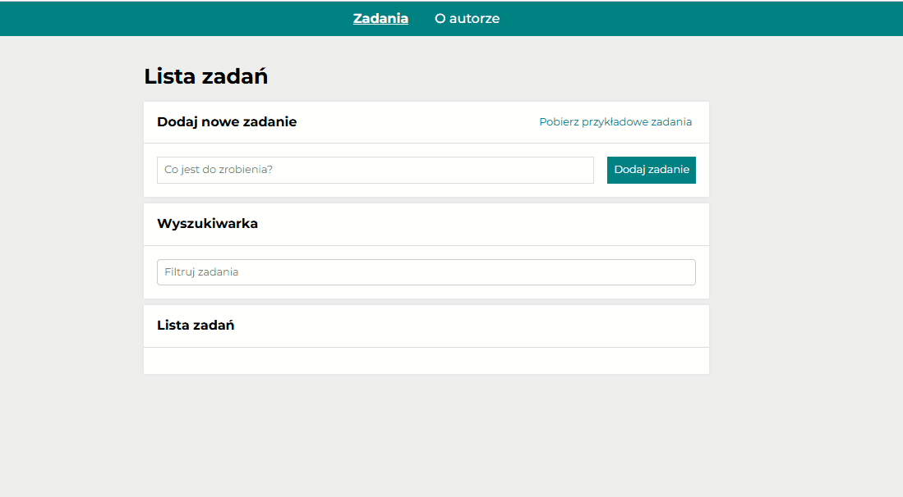

# To-Do List

## 

## 🔗 Live Demo  

[View Project](https://annaczerwonka.github.io/todo-list-react/)

## 📝 Description  

A modern task management app built with React, Redux Toolkit, and styled-components.
The app allows users to add, complete, filter, and remove tasks, browse task details, and view author information on a separate page.

## ⚙️ Key Features  

- Add new tasks via an interactive form  
- Mark tasks as done or remove them  
- Filter and hide completed tasks  
- Search tasks dynamically  
- Load example tasks from an external source  
- Save state automatically to localStorage
- Built-in navigation and routing between pages (Tasks list / Task details / Author)  
- Fully responsive design  

## 💻 Technologies Used

- React.js – functional components & React Hooks (useState, useEffect)
- React Router – multi-page navigation and routing
- Redux Toolkit (createSlice, useSelector, useDispatch) – global state management styled-components – component-level CSS-in-JS styling
- ThemeProvider – centralized theme and color management
- localStorage API – saving and restoring data from browser storage
- Fetch API / async–await – asynchronous data fetching (example tasks)
- Create React App – project setup and build configuration (Webpack, Babel, ESLint)
- JavaScript (ES6+), HTML5, CSS3 – core front-end technologies (Flexbox, Grid)

## 📄 Summary  

This project demonstrates the practical use of React, Redux Toolkit, and styled-components in building a modern, dynamic to-do list application with persistent state and responsive design.

# Getting Started with Create React App

This project was bootstrapped with [Create React App](https://github.com/facebook/create-react-app).

## Available Scripts

In the project directory, you can run:

### `npm start`

Runs the app in the development mode.\
Open [http://localhost:3000](http://localhost:3000) to view it in your browser.

The page will reload when you make changes.\
You may also see any lint errors in the console.

### `npm run build`

Builds the app for production to the `build` folder.\
It correctly bundles React in production mode and optimizes the build for the best performance.

The build is minified and the filenames include the hashes.\
Your app is ready to be deployed!

See the section about [deployment](https://facebook.github.io/create-react-app/docs/deployment) for more information.

### `npm run eject`

**Note: this is a one-way operation. Once you `eject`, you can't go back!**

If you aren't satisfied with the build tool and configuration choices, you can `eject` at any time. This command will remove the single build dependency from your project.

Instead, it will copy all the configuration files and the transitive dependencies (webpack, Babel, ESLint, etc) right into your project so you have full control over them. All of the commands except `eject` will still work, but they will point to the copied scripts so you can tweak them. At this point you're on your own.

You don't have to ever use `eject`. The curated feature set is suitable for small and middle deployments, and you shouldn't feel obligated to use this feature. However we understand that this tool wouldn't be useful if you couldn't customize it when you are ready for it.

